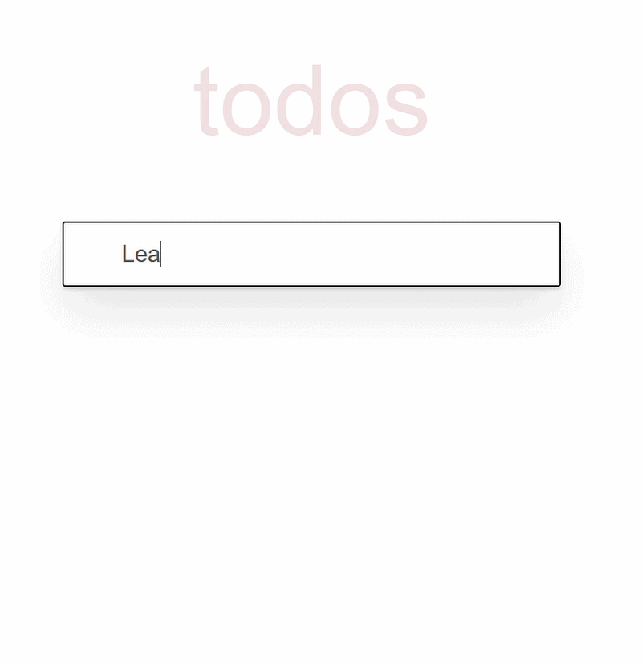

# ✅ TodoApp

A React + TypeScript implementation of the classic TodoMVC app — add, edit, filter, and manage your tasks, with everything persisted in `localStorage`.

🔗 **[View live demo](https://yuliia-nudyk.github.io/to-do-app/)**



## 📝 Description

TodoApp lets you keep track of your tasks: add new ones, mark them complete, edit titles inline, filter by status, and clear completed items in bulk — all with no backend, since the full list is persisted directly in the browser's `localStorage`.

### Features

- Add new todos via a simple input field
- Mark individual todos as complete, or toggle all at once
- Inline editing — double-click a todo to rename it, save on Enter/blur, cancel on Escape
- Deleting a todo by clearing its title while editing
- Filter todos by status: All / Active / Completed
- Clear all completed todos in one click
- Data persisted in `localStorage`, so your list survives a page reload

## 🛠 Technologies

- React 18 + TypeScript
- SCSS (Sass)
- Vite — build tool

## 💡 Technical highlights

- **Custom hooks separate concerns cleanly**: `useTodoActions` centralizes all CRUD operations (add, delete, update, toggle all, clear completed) in one place, `useFilteredTodos` memoizes status-splitting and filtering with `useMemo`, and `useEditMode` encapsulates the double-click-to-edit / Escape-to-cancel behavior as a reusable, todo-agnostic hook.
- **`localStorage` synced via a generic `useLocalStorage<T>` hook**, using React's lazy `useState` initializer so the stored value is only read once, not on every render.
- **Minimal, focused Context** — `TodosContext` holds only the todos list and its setter; UI state (filter, edit mode) stays local to the components that need it, avoiding an overloaded "God context."
- **Type-safe status handling with `as const`** instead of a TypeScript `enum`, keeping the value set centralized and autocomplete-friendly without emitting extra runtime code.
- **Symmetric view/edit sub-components** (`TodoView` / `TodoEditForm`) keep `TodoItem` focused on coordinating state rather than rendering markup directly.

## 🚀 Running locally

1. Clone the repository:

```bash
   git clone https://github.com/yuliia-nudyk/to-do-app.git
```

2. Navigate to the project folder:

```bash
   cd to-do-app
```

3. Install dependencies:

```bash
   npm install
```

4. Run the project locally:

```bash
   npm start
```

## 📂 Project structure
 
```
to-do-app/
├── public/
│   ├── favicon.png
│   └── gif.gif
│
└── src/
    ├── components/
    │   ├── Footer.tsx
    │   ├── Header.tsx
    │   └── ...
    │
    ├── contexts/
    │   └── todoContext.tsx
    │
    ├── hooks/
    │   ├── useEditMode.ts
    │   ├── useFilteredTodos.ts
    │   └── ...
    │
    ├── styles/
    │   └── ...
    │
    ├── types/
    │   ├── FilterStatus.ts
    │   ├── Todo.ts
    │   └── ...
    │
    ├── utils/
    │   ├── pickFilteredTodos.ts
    │   ├── splitTodosByStatus.ts
    │   └── ...
    │
    ├── App.tsx
    ├── index.tsx
    └── vite-env.d.ts
```
